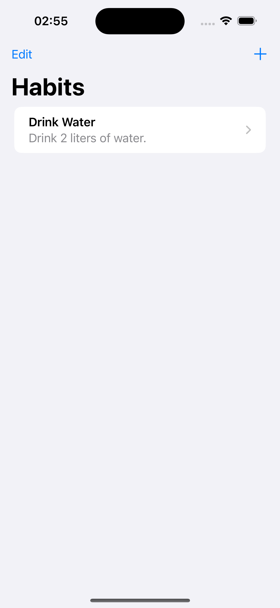

# HabitTracker

HabitTracker is a simple iOS app built using SwiftUI for tracking your daily habits. Designed for 100DaysOfSwiftUI.

## Features

- **Add New Habit**: Easily add new habits with a name and description.
- **Track Progress**: Increment the count of your habits each time you complete them.
- **Edit and Delete**: Edit existing habits or delete them as needed.
- **Persistent Storage**: All your habits are stored locally using UserDefaults.

## Screenshots

## Installation

1. Clone or download this repository.
2. Open the project in Xcode.
3. Build and run the app on a simulator or your iOS device.

## Usage

1. Launch the app.
2. Tap on the "+" button in the top right corner to add a new habit.
3. Fill in the habit name and description, then tap "Save".
4. Your new habit will appear in the list. Swipe left to increase its count or swipe right to delete it.
5. Tap on a habit to view its details and track its progress.

## Requirements

- iOS 14.0+
- Xcode 13.0+
- Swift 5.5+

## License

This project is licensed under the MIT License - see the [LICENSE](LICENSE.md) file for details.
